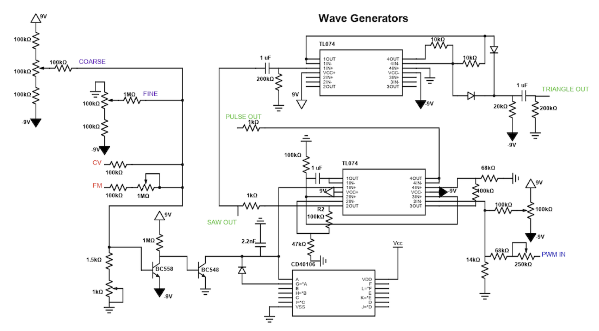
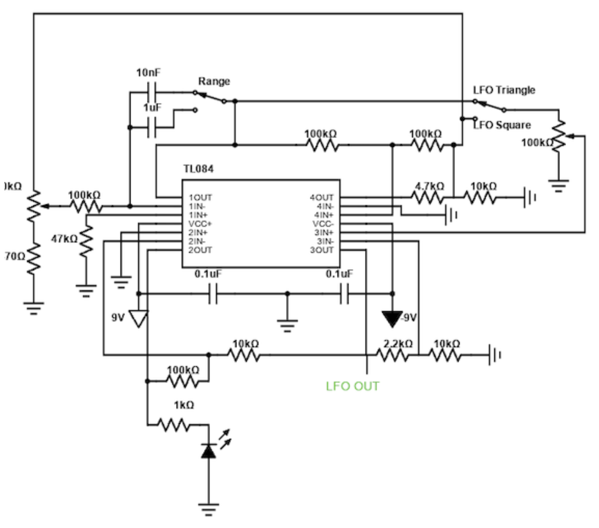
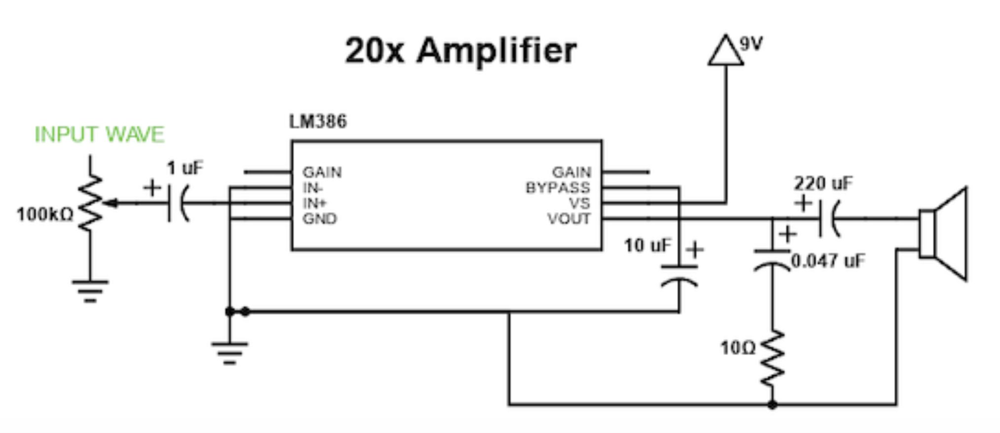

# Analog Synthesizer

A discrete analog synthesizer built on a breadboard, generating and shaping sawtooth, pulse, and triangle waveforms with voltage-controlled pitch, pulse-width modulation, and low-frequency modulation (vibrato/tremolo), driven out to a speaker through a 20x op-amp amplifier stage.

The design is modeled on a commercial synth VCO/LFO/amplifier reference circuit, reproduced and validated on breadboard with an oscilloscope.

## Features

- **VCO (Voltage-Controlled Oscillator):** Generates sawtooth and variable-duty-cycle pulse waveforms using a CD40106 Schmitt trigger inverter, with coarse/fine frequency controls, CV (control voltage) input, and FM input.
- **Saw-to-Triangle Converter:** Shapes the sawtooth output into a triangle waveform using a TL074 op-amp stage.
- **LFO (Low-Frequency Oscillator):** Built on a TL084 quad op-amp, producing triangle/square modulation signals with adjustable range, used to modulate pitch (vibrato) or amplitude (tremolo) via CV, FM, and PWM inputs.
- **20x Amplifier:** LM386-based output stage that boosts the selected waveform (triangle, sawtooth, or pulse) to drive a speaker.
- **Selectable Waveform Output:** Any of the three shaped waveforms can be routed to the amplifier input.

## System Architecture

```
                 ┌─────┐
                 │ LFO │
                 └──┬──┘
        ┌───────────┼───────────┐
        ▼           ▼           ▼
      ┌────┐      ┌────┐     ┌────────┐
      │ CV │      │ FM │     │ PWM IN │
      └─┬──┘      └─┬──┘     └───┬────┘
        └─────┬──────┴─────┬─────┘
              ▼             ▼            ▼
        ┌──────────┐  ┌──────────┐  ┌──────────┐
        │ Triangle │  │ Sawtooth │  │  Pulse   │
        │  Output  │  │  Output  │  │  Output  │
        └────┬─────┘  └────┬─────┘  └────┬─────┘
             └─────────────┼─────────────┘
                            ▼
                     ┌─────────────┐
                     │ 20x Amplifier│
                     └──────┬──────┘
                            ▼
                       ┌─────────┐
                       │ Speaker │
                       └─────────┘
```

**Signal stages:**

1. **VCO** — CD40106 Schmitt trigger core generates the raw sawtooth and pulse waves. TL074 op-amps buffer/shape the signals; diodes and RC networks set timing and duty cycle.
2. **Saw-to-Triangle Converter** — A dedicated TL074 stage integrates the sawtooth into a triangle wave.
3. **LFO** — A TL084-based relaxation oscillator produces a slow triangle/square wave, routed into the VCO's CV, FM, and PWM inputs to modulate pitch or pulse width.
4. **Amplification** — An LM386-based 20x gain stage drives the selected waveform to the speaker.

> **Note:** This build omits the low-pass filter present in the original reference design. Its function was limited to shaping the final audio output by attenuating high frequencies; omission does not affect core oscillator/modulation behavior.

## Schematic & Hardware

### Schematic (Scheme-it)


*VCO / Saw-to-Triangle stage:*


*LFO stage:*


*20x Amplifier stage:*


### Breadboard Build


*Oscilloscope capture of pulse wave output:*


### Demo Video
[Video of Project](#) <!-- replace with hosted video link -->

## Bill of Materials

| Part | Quantity |
|---|---|
| CD40106 Schmitt Trigger Inverter Chip | 1 |
| TL074 Op-Amp Chip | 2 |
| TL084 Quad Op-Amp Chip | 1 |
| LM386 Audio Amplifier Chip | 1 |
| 1N4148 Diode | 3 |
| LED | 1 |
| 9V Battery | 2 |
| Battery Clip | 2 |
| Switch | 2 |
| Speaker | 1 |
| Breadboard | 1 |

### Resistors

| Value | Quantity |
|---|---|
| 10 Ω | 1 |
| 470 Ω | 1 |
| 1 kΩ | 5 |
| 1.5 kΩ | 1 |
| 2.2 kΩ | 1 |
| 10 kΩ | 5 |
| 12 kΩ | 1 |
| 20 kΩ | 1 |
| 33 kΩ | 1 |
| 47 kΩ | 2 |
| 68 kΩ | 2 |
| 100 kΩ | 12 |
| 200 kΩ | 2 |
| 1 MΩ | 2 |

### Potentiometers

| Value | Quantity |
|---|---|
| 1 kΩ | 1 |
| 100 kΩ | 5 |
| 500 kΩ | 1 |
| 1 MΩ | 1 |

### Capacitors

| Value | Quantity |
|---|---|
| 2.2 nF | 1 |
| 0.047 µF | 1 |
| 0.1 µF | 3 |
| 1 µF | 5 |
| 10 µF | 2 |
| 220 µF | 1 |

## Operating Instructions

1. **Power up:** Connect two 9V batteries to provide the split supply (+9V / −9V) required by the op-amp stages. Confirm both switches are set to the on position.
2. **Set base pitch:** Use the **COARSE** and **FINE** potentiometers on the VCO to set the sawtooth/pulse base frequency.
3. **Adjust pulse width:** Use the **PWM** potentiometer to vary pulse wave duty cycle manually, or route the LFO into **PWM IN** for automatic modulation.
4. **Enable modulation (optional):**
   - Route LFO output into **CV** for vibrato (pitch modulation).
   - Route LFO output into **FM** for frequency modulation effects.
   - Adjust the LFO **Range** switch and rate potentiometer to set modulation speed (triangle vs. square LFO waveform selectable).
5. **Select output waveform:** Feed the desired waveform (triangle, sawtooth, or pulse) into the 20x amplifier's input.
6. **Adjust volume:** Use the amplifier's input potentiometer to set output level to the speaker.
7. **Verify with oscilloscope:** Probe VCO test points to confirm waveform shape and frequency before relying on audio output alone.

### Calibration / Debug Notes

- If output is noisy, confirm all unused pins on the CD40106 are tied to ground — this eliminated significant noise in testing.
- Build and verify the VCO and saw-to-triangle stages first using oscilloscope test points before wiring the LFO and amplifier stages; this significantly simplifies fault isolation.
- Double check diode orientation in the saw-to-triangle converter and PWM duty-cycle network, as this is a common source of malformed waveforms.

## Design Notes

- Circuit closely follows a commercial reference design (schematics/datasheets provided by instructor), with two deviations: local battery voltage (dual 9V vs. original supply) and omission of the output low-pass filter.
- Initial builds failed to produce correct sawtooth/pulse shapes; rebuilding against the schematic with active oscilloscope verification at each stage resolved this.
- Recommended future improvements: reorganize potentiometer placement for accessibility, color-code wiring by signal type, and add the omitted low-pass filter stage.

## Repository Structure

See [folder layout](#recommended-repository-folder-layout) below for how source files are organized.
